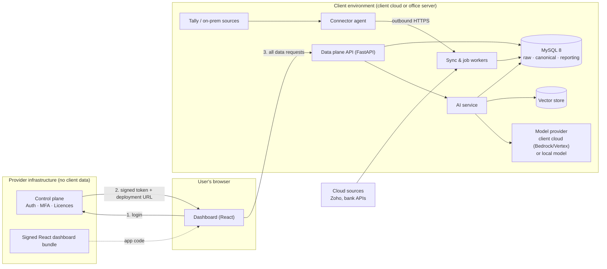

# Architecture: Accounting Data Integration & Analytics Platform

| Field | Value |
| --- | --- |
| Version | 0.3 (Draft) |
| Date | 2026-10-08 |
| Related | `docs/requirements.md`, `CLAUDE.md` |

---

## 1. Design principles

1. **Data sovereignty.** The provider stores only logins, user-to-client mapping and licences. All client data lives and is processed in the client's own environment (PM-003 to PM-006).
2. **Read-only towards sources.** The platform never writes to Tally, Zoho, banks or upstream systems (CON-008).
3. **Pluggable connectors.** Every data source is an adapter behind one interface; the core never depends on a specific source (CON-001, MNT-002).
4. **One codebase, many clients.** Client differences are configuration, never forks (MNT-001).
5. **Secure by default.** Encryption, least privilege, signed releases, no telemetry (Section 5 of requirements).
6. **Verifiable numbers.** Every figure, including AI answers, can be traced to source records (AI-002, RPT-007).

## 2. System overview

The system has three deployable parts:

| Part | Hosted by | Holds client data? | Purpose |
| --- | --- | --- | --- |
| **Control plane** | Provider | **No** | Login, MFA, licence checks, user-to-client mapping, serving the signed dashboard bundle. |
| **Client deployment (data plane)** | Client (own cloud account by default, or office server) | Yes | Database, connectors, sync, validation, reporting API, AI layer, audit log. |
| **Connector agent** | Client (on machine near Tally or other on-prem sources) | Transiently | Reads on-prem sources and pushes changes outbound to the client deployment. |



## 3. Control plane

**Responsibilities:** user accounts, password hashing, MFA, login, token issuance, licence status, client registry (client ID → deployment URL), platform admin console, hosting the signed frontend bundle.

**Stores only:**

- `clients` — client ID, name, licence status, deployment URL, token-signing settings.
- `users` — user ID, email, password hash, MFA secret (encrypted), client ID, status.
- `auth_events` — security events only (login success/failure, lockouts), no business activity.

**Does not store:** roles, entity permissions, connection details, any accounting data, report or AI activity. Those live in the client deployment.

**Token flow:**

1. User logs in at the control plane (password + MFA).
2. Control plane checks the licence and issues a short-lived signed JWT (e.g. 15 minutes, refreshable) containing user ID, client ID and audience = that client's deployment.
3. Browser calls the client deployment directly with the token.
4. Client deployment verifies the signature using the control plane's published public keys (JWKS), then applies its own local roles and permissions.

## 4. Client deployment (data plane)

### 4.1 Components

| Component | Technology | Role |
| --- | --- | --- |
| API | Python, FastAPI | Reporting, admin, connections, AI endpoints; token verification; authorization. |
| Workers | Python, Celery (or equivalent) + Redis | Sync jobs, imports, validation, scheduled reports, alerts. |
| Database | MySQL 8 | All accounting data, local roles/permissions, audit log. |
| Vector store | Qdrant (self-hosted) | Embeddings for schema docs, business definitions, uploaded documents. |
| AI service | Python module within the API/workers | Text-to-SQL, explanations, insights; provider abstraction. |
| File storage | Local volume or client's object storage | Raw uploaded files, backup files, (later) scanned documents. |
| Reverse proxy | Caddy or Nginx | TLS termination, CORS limited to the dashboard origin. |

### 4.2 Data layers

| Layer | Purpose | Examples |
| --- | --- | --- |
| **Raw** | Data exactly as received, with source metadata. Enables reprocessing (DAT-008). | `raw_records` (source, connection, batch, entity type, payload JSON, received_at) |
| **Canonical** | Standard, source-independent accounting model. | ledgers, vouchers, voucher lines, parties |
| **Reporting** | Views and aggregates used by dashboards and AI (the semantic layer). | `v_trial_balance`, `v_pnl_monthly`, `v_receivables_ageing` |

### 4.3 Canonical model (initial outline)

To be detailed in `docs/schema.md`.

- **Organization:** `entities`, `branches`, `financial_years`, `currencies`, `exchange_rates`
- **Masters:** `account_groups` (hierarchical), `ledgers`, `parties`, `items`, `units`, `godowns`, `cost_centres`, `projects`, `tax_codes`
- **Transactions:** `vouchers` (header), `voucher_lines` (double-entry lines), `voucher_line_dimensions`, `inventory_lines`, `tax_lines`, `bill_allocations`
- **Dimensions:** `dimensions`, `dimension_values` (user-defined dimensions, DAT-005)
- **Integration:** `sources`, `connections` (credentials encrypted), `sync_runs`, `import_batches`, `record_origins`, `account_mappings`
- **Quality:** `validation_runs`, `validation_issues`
- **Security:** `roles`, `permissions`, `user_roles`, `user_entity_access`, `masking_rules`
- **Audit:** `audit_log`

Every canonical row carries `entity_id`, source origin and timestamps. Amounts use `DECIMAL(20,4)`, never floating point.

### 4.4 Connector framework

Each connector implements:

```text
test_connection() -> status
list_entities() -> companies/entities available in the source
fetch_masters(entity, since_marker) -> raw records + new marker
fetch_transactions(entity, since_marker) -> raw records + new marker
to_canonical(raw_record) -> canonical records
```

The framework handles scheduling, retries, markers (last AlterID, last modified time), logging to `sync_runs` and validation after each run.

In code, the interface is the `Connector` protocol in `data-plane/connectors/base.py`; `fetch_*` return iterators of `RawRecord` so large sources stream. A registry maps a source code (`tally`, later `file`, `zoho`, ...) to its connector. Storing raw records (`core/raw_store.py`) and running an extraction (`workers/extract.py`, `python -m workers.cli`) are source-independent; nothing outside `connectors/<source>/` knows about a particular source.

**Tally:** XML requests over Tally's HTTP interface (default port 9000). The adapter sends only Export requests (TDL collections with explicit fetch lists, targeting a company by name), fetches vouchers month by month, and handles UTF-16 responses and invalid character references emitted by Tally. Incremental sync uses AlterID/MasterID values. Version differences are handled inside the Tally adapter. Historical Tally backups are restored into a Tally instance and extracted through the same adapter.

**Files (CSV/TXT):** upload or watched folder; saved column mappings per file layout.

**Cloud APIs (Zoho, banks):** OAuth where supported; webhooks for near real-time updates, polling as fallback.

### 4.5 Connector agent

- Lightweight service installed on the machine running Tally (or near other on-prem sources).
- Polls the local source at the configured interval and pushes changes to the client deployment over outbound HTTPS with mutual authentication (agent certificate or signed agent token).
- Local queue so data is not lost during network outages.
- If the client deployment runs on the same network as Tally, the agent runs alongside the deployment instead.
- Holds only its own credentials; no long-term storage of data.

### 4.6 Validation

After each sync or import: voucher balance check, trial balance check, ledger closing balance comparison against source-reported figures. Results go to `validation_runs` / `validation_issues` and feed the data-quality dashboard and alerts.

## 5. AI layer

### 5.1 Approach

Numeric and analytical questions use **text-to-SQL** against the semantic layer, not plain retrieval of data chunks, so totals and comparisons are exact.

1. User asks a question.
2. Relevant schema descriptions and business definitions are retrieved from the vector store (RAG).
3. The model generates SQL restricted to semantic-layer views.
4. SQL is validated (single read-only `SELECT`, allowed views only, user's entity filters injected).
5. Query runs under a read-only database user with timeout and row limits.
6. The model explains the result; the answer shows the SQL and links to source records.

### 5.2 Guardrails

- Dedicated read-only MySQL user with access only to reporting views.
- Entity/branch filters from the user's permissions are enforced in SQL, not left to the model.
- Masking rules applied before data is sent to the model.
- All AI questions and generated SQL logged in the client's audit log.

### 5.3 Model provider abstraction

A single internal interface with configurable providers per client:

| Provider option | Data location | Notes |
| --- | --- | --- |
| Claude via AWS Bedrock (client account) | Client's cloud agreement | Default for cloud deployments on AWS. |
| Claude via Google Vertex AI (client account) | Client's cloud agreement | Default for cloud deployments on GCP. |
| Open-weight model on client hardware (e.g. via Ollama) | Fully local | For strictest clients and for the local pilot on client data; lower quality on complex questions. |
| Anthropic API (direct) | Anthropic | **Development and test data only.** Never used with client data unless the client approves. |

No provider path sends data to provider (our) infrastructure.

## 6. Frontend

- React + TypeScript, built with Vite.
- TanStack Query for data fetching and caching; Ant Design for tables, filters and forms; Apache ECharts for charts.
- Logs in via the control plane; all data calls go to the client deployment URL from the token.
- Content Security Policy restricts connections to the control plane and that client's deployment (SEC-005).
- Released as a signed bundle; can also be self-hosted by the client (SEC-006).

## 7. Security design summary

| Area | Measure |
| --- | --- |
| Data location | All client data in client environment only. |
| Identity | Argon2id password hashes, MFA, short-lived signed tokens, optional SSO. |
| Authorization | Roles and entity/branch/report permissions enforced in the client deployment. |
| Transport | TLS everywhere; mutual auth for agents. |
| At rest | Encrypted database volumes and backups; encrypted connection credentials (application-level encryption with a client-held key). |
| Sources | Read-only access only. |
| AI | Read-only SQL user, semantic-layer-only access, masking, audit. |
| Supply chain | Signed images and bundles, verified on update; dependency and image scanning in CI. |
| Telemetry | None leaves the client environment. |

## 8. Deployment and updates

- Client deployment ships as Docker images with a Docker Compose configuration for a single server or a single cloud VM. Kubernetes packaging can follow if larger clients need it.
- Configuration via environment variables and a config file; no cloud-specific services required in the core.
- Releases are versioned; updates pull signed images, verify signatures, run database migrations (Alembic) and restart services.
- Automated daily database backups within the client environment.
- Provider support access to a client deployment happens only with explicit, time-limited client permission.

## 9. Technology stack

| Concern | Choice |
| --- | --- |
| Backend language | Python 3.12+ |
| Python packaging | uv (`pyproject.toml`, `uv.lock`) |
| API framework | FastAPI |
| ORM / migrations | SQLAlchemy 2 + Alembic |
| Database | MySQL 8 |
| Background jobs | Celery + Redis |
| Vector store | Qdrant |
| Frontend | React, TypeScript, Vite, TanStack Query, Ant Design, Apache ECharts |
| Auth tokens | JWT (asymmetric signing, JWKS) |
| Packaging | Docker, Docker Compose |
| Testing | pytest (backend), Vitest + Testing Library (frontend), Playwright (end-to-end) |

## 10. Repository structure (proposed)

```text
/control-plane        FastAPI service: auth, licences, client registry
/data-plane
  /api                FastAPI service: reporting, admin, AI endpoints
  /core               canonical model, validation, permissions
  /connectors         one package per source (tally, files, zoho, ...)
  /workers            sync, import, validation, scheduled jobs
  /ai                 text-to-SQL, provider abstraction, guardrails
  /migrations         Alembic migrations
/agent                connector agent
/frontend             React + TypeScript dashboard
/deploy               Docker, Compose files, release scripts
/docs                 requirements, architecture, schema, decisions
```

## 11. Decision log

| ID | Decision | Reason |
| --- | --- | --- |
| ADR-001 | Split into provider control plane and client-hosted data plane. | Provider may store only login credentials (PM-003). |
| ADR-002 | Client's own cloud account is the default deployment target; office server supported. | Managed security, backups and real-time availability; flexibility for strict clients. |
| ADR-003 | Text-to-SQL over a semantic layer for numeric questions; RAG for context and documents. | Exact financial figures; plain retrieval cannot sum or compare reliably. |
| ADR-004 | Pluggable AI provider; default Claude via client's cloud account; local model option. | Client requires data security; no data to provider infrastructure. |
| ADR-005 | Raw / canonical / reporting data layers. | Reprocessing, lineage and source independence. |
| ADR-006 | Connector agent with outbound-only connections for on-prem sources. | Works when Tally is not on the deployment's network; no inbound firewall rules. |
| ADR-007 | Roles and permissions stored in the client deployment, not the control plane. | Keeps organizational data out of provider infrastructure. |
| ADR-008 | Signed frontend bundle with strict CSP; self-host option. | Prevents a compromised control plane from silently exfiltrating data. |
| ADR-009 | Pilot first on the client's backup data, running the data plane locally. | Proves extraction, model and dashboard on real data before building product infrastructure. |
| ADR-010 | `AUTH_MODE=local` during the pilot; token verification sits behind an interface. | Lets the control plane replace local login later without changing authorization code. |
| ADR-011 | Separate `test` and `pilot` environments with separate databases. | Keeps client data away from AI development tools and external AI APIs. |
| ADR-012 | Each environment runs as its own Docker Compose project (`ledgerbridge-test`, `ledgerbridge-pilot`) with its own volumes, host ports and env file. | Keeps the schema names `raw`, `core`, `rpt`, `app` identical in every environment while keeping data physically separate. |
| ADR-013 | uv manages Python versions and dependencies for the data plane (`pyproject.toml` + `uv.lock`). | Reproducible locked installs and a pinned Python 3.12 independent of the host Python. |
| ADR-014 | One narrow exception to "read-only towards sources" (CON-008): the developer-only seeding tool in `data-plane/devtools/tally_seed` may send Tally **Import** requests, and only to the test company. It refuses to run unless `APP_ENV=test`, exactly one company is loaded and its name matches the target exactly. It is never imported by product code, is excluded from the Docker image (`.dockerignore`), and connectors keep their Export-only client. | The test company needs realistic, repeatable data (bills, GST, cancelled and altered vouchers) to prove extraction and the sign convention; hand entry is slow and not repeatable. |

New decisions are appended here with the next ADR number.

## 12. Open technical questions

- Exact Tally versions and sample data for testing version compatibility.
- Whether larger clients need Kubernetes packaging in phase 1.
- Local model choice and minimum GPU specification for the fully local AI option.
- Key management approach per cloud (cloud KMS vs client-managed key file for office servers).

## 13. Local pilot mode

The pilot runs the data plane on the developer's Windows machine.

- **Services:** Docker Compose runs MySQL, Redis, Qdrant, the API and workers; the frontend runs with the Vite dev server.
- **Reaching Tally:** TallyPrime runs on the Windows host with its XML server on port 9000. `TALLY_URL` is `http://localhost:9000` for tools run on the host; Compose overrides it to `http://host.docker.internal:9000` inside containers.
- **Companies:** the companies to extract must be loaded (open) in TallyPrime during extraction. The connector targets each company by name in its XML requests, so one run can process several companies.
- **Environments:** two separate configurations, each with its own database:

| Environment | Data | AI provider | Used by Claude Code? |
| --- | --- | --- | --- |
| `test` | LedgerBridge Test Co (developer-created) | Anthropic API | Yes |
| `pilot` | Client backup companies | Local model (Ollama) | **No** — run by the developer only |

- **Environment separation (ADR-012):** each environment is a separate Compose project started from the same `deploy/compose.yaml`: `ledgerbridge-test` with `.env.test`, `ledgerbridge-pilot` with `.env.pilot`. Volumes are scoped per project and host ports differ per environment, so the two never share a database, cache or vector store. `.env.*.example` files are committed; real `.env.*` files are git-ignored. The data plane refuses `AI_PROVIDER=anthropic` when `APP_ENV=pilot` (PIL-005).

- **Auth:** `AUTH_MODE=local` stores users with Argon2id password hashes in `app.users` and issues tokens locally. In product mode the data plane instead verifies control-plane tokens via JWKS; authorization code is identical in both modes.
