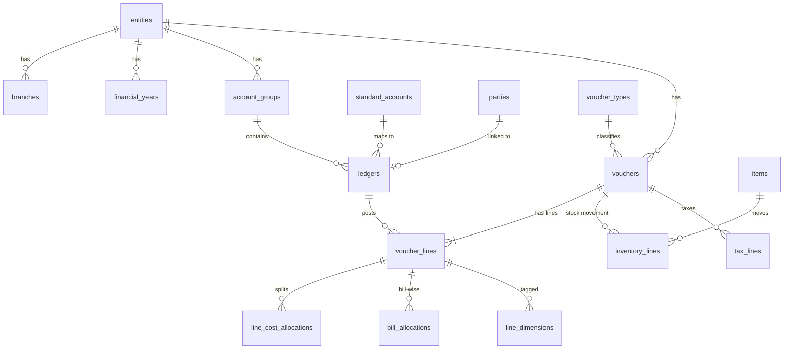

# Database Schema: Client Deployment (MySQL 8)

| Field | Value |
| --- | --- |
| Version | 0.5 (Draft) |
| Date | 2026-10-09 |
| Related | `docs/requirements.md` (DAT-*, IMP-*, VAL-*, ACC-*, AUD-*), `docs/architecture.md` Section 4 |

This document describes the database inside each **client deployment**. The control plane has its own small database (users, clients, licences), described in `docs/architecture.md` Section 3.

---

## 1. Conventions

| Topic | Convention |
| --- | --- |
| Engine / charset | InnoDB, `utf8mb4`, collation `utf8mb4_0900_ai_ci`. |
| Primary keys | `id BIGINT UNSIGNED AUTO_INCREMENT` unless stated. |
| Money | `DECIMAL(20,4)`. Never `FLOAT`/`DOUBLE`. |
| Quantities, rates | `DECIMAL(20,6)`. |
| Sign convention | **Debit = positive, credit = negative** for all amounts in the canonical layer. |
| Dates | `DATE` for accounting dates; `DATETIME(6)` in UTC for system timestamps. |
| Timestamps | Every table has `created_at`, `updated_at`. |
| Deletes | Synced data is soft-deleted (`is_deleted`), never physically removed, to keep history and audit. |
| Naming | `snake_case`, plural table names, foreign keys named `<table_singular>_id`. |
| Entity scoping | Every canonical business table carries `entity_id`, and every query from reports or AI filters by it. |

### 1.1 Source-tracking columns

Every canonical table populated from a source carries these columns (abbreviated as **[SRC]** below):

| Column | Type | Purpose |
| --- | --- | --- |
| `connection_id` | BIGINT UNSIGNED | Which connection the record came from. |
| `source_key` | VARCHAR(191) | Stable ID in the source (Tally GUID, Zoho ID, file row key). |
| `source_alter_id` | BIGINT NULL | Source change counter (Tally AlterID) for incremental sync. |
| `origin` | ENUM('live','backup','file','manual') | How the record arrived (IMP-004). |
| `import_batch_id` | BIGINT UNSIGNED NULL | Batch for backup/file imports. |
| `raw_record_id` | BIGINT UNSIGNED NULL | Link to the raw record it was built from (lineage). |
| `is_deleted` | BOOLEAN DEFAULT FALSE | Soft delete when removed in source. |

Unique key on `(connection_id, source_key)` makes every sync an idempotent upsert.

## 2. Database layout

Four MySQL databases separate concerns and permissions. Each holds one **layer** of the design (architecture.md 4.2). The database names are readable and prefixed (ADR-016):

| Database | Layer | Contents | Who can access |
| --- | --- | --- | --- |
| `ledgerbridge_source` | Raw | Data exactly as received from sources. | Application only. |
| `ledgerbridge_accounting` | Canonical | Canonical accounting model. | Application (read/write); reporting user (read). |
| `ledgerbridge_reporting` | Reporting (semantic layer) | Views and aggregate tables. | Application; reporting user; **AI user (read-only, this database only)**. |
| `ledgerbridge_system` | System | Connections, sync, validation, security, audit, settings; Alembic's version table. | Application only. |

### 2.1 Database users

| User | Rights | Used by |
| --- | --- | --- |
| `app_rw` | `SELECT`, `INSERT`, `UPDATE`, `DELETE` on all four databases. No DDL. | API and workers. |
| `report_ro` | `SELECT` on `ledgerbridge_accounting` and `ledgerbridge_reporting`. | Reporting endpoints. |
| `ai_ro` | `SELECT` on **`ledgerbridge_reporting` only**; statement timeout set per session by the AI service (M8). | AI text-to-SQL execution (AI-003). |
| `migrator` | All privileges on the four databases, including DDL and `REFERENCES`. | Alembic migrations only, run in the one-off `migrate` container. Never available to the API or workers. |

The users and the four databases are created when MySQL first initialises its volume (`deploy/mysql/init/01-schemas.sh`), because Alembic can't create the user it runs as. Passwords come from the environment's env file.

## 3. `ledgerbridge_source` (raw layer)

### `ledgerbridge_source.raw_records`

| Column | Type | Notes |
| --- | --- | --- |
| id | BIGINT UNSIGNED PK | |
| connection_id | BIGINT UNSIGNED | |
| sync_run_id | BIGINT UNSIGNED NULL | Set for live syncs. |
| import_batch_id | BIGINT UNSIGNED NULL | Set for backup/file imports. |
| source_entity_key | VARCHAR(191) | Source company identifier. |
| object_type | VARCHAR(64) | e.g. `ledger`, `voucher`, `stock_item`. |
| source_key | VARCHAR(191) | |
| source_alter_id | BIGINT NULL | |
| payload_format | ENUM('xml','json','csv','txt') | |
| payload | LONGTEXT | Original record, unchanged. |
| payload_hash | CHAR(64) | SHA-256, skips unchanged re-deliveries. |
| received_at | DATETIME(6) | |
| process_status | ENUM('pending','processed','failed','skipped') | |
| process_error | TEXT NULL | |

Indexes: `(connection_id, object_type, source_key)`, `(process_status, received_at)`. Partition by month of `received_at` once volumes grow.

For XML sources, `payload` holds one source object (e.g. one Tally `<VOUCHER>` element) re-serialized from the response without changing its content. A record is skipped when the latest stored record for the same `(connection_id, object_type, source_key)` has the same `payload_hash`.

**Implementation status:**

| Migration | Milestone | Creates |
| --- | --- | --- |
| `0001` | M1 | `ledgerbridge_source.raw_records`, `ledgerbridge_system.sources`, `ledgerbridge_system.connections`, `ledgerbridge_system.sync_runs` |
| `0002` | M2 | Every other table in Sections 4 and 5, except `ledgerbridge_accounting.bank_statement_lines` (phase 2). Adds the `connections.agent_id` foreign key. |
| `0003` | M2 | Reference data: the `INR` currency and the default standard chart of accounts (Section 4.2) |

`ledgerbridge_reporting` exists from M2 but stays empty until M6 (Section 6). The per-call AI model log (AI-018) is designed in M8. Type and key choices for tables documented here only as column lists are in Section 9.

## 4. `ledgerbridge_accounting` (canonical model)

### 4.1 Organization

#### `ledgerbridge_accounting.entities`

| Column | Type | Notes |
| --- | --- | --- |
| id | BIGINT UNSIGNED PK | |
| code | VARCHAR(32) UNIQUE | Short code used in reports. |
| name | VARCHAR(255) | |
| legal_name | VARCHAR(255) NULL | |
| country_code | CHAR(2) | Default `IN`. |
| state_code | VARCHAR(8) NULL | |
| gstin | VARCHAR(15) NULL | |
| pan | VARCHAR(10) NULL | |
| base_currency_code | CHAR(3) | Default `INR`. |
| fy_start_month | TINYINT | Default 4 (April) (DAT-006). |
| books_from | DATE NULL | Company inception / books start (IMP-001). |
| is_active | BOOLEAN | |

#### `ledgerbridge_accounting.entity_sources`

Links a source company (e.g. a Tally company) to an entity. One entity can have several sources (Tally for books, a bank feed, a CSV upstream system).

| Column | Type | Notes |
| --- | --- | --- |
| id | BIGINT UNSIGNED PK | |
| entity_id | BIGINT UNSIGNED FK | |
| connection_id | BIGINT UNSIGNED FK | |
| source_entity_key | VARCHAR(191) | Tally company GUID or name, Zoho organization ID. |
| source_entity_name | VARCHAR(255) | |
| precedence | SMALLINT | Higher wins on overlap (IMP-005). |
| active_from / active_to | DATE NULL | Period this source is authoritative for. |

Unique: `(connection_id, source_entity_key)`.

#### `ledgerbridge_accounting.branches`

`id, entity_id, code, name, state_code, gstin, is_active`. Unique `(entity_id, code)`.

#### `ledgerbridge_accounting.financial_years`

`id, entity_id, label, start_date, end_date, is_closed`. Unique `(entity_id, start_date)`.

#### `ledgerbridge_accounting.currencies` and `ledgerbridge_accounting.exchange_rates`

- `currencies`: `code CHAR(3) PK, name, decimal_places`.
- `exchange_rates`: `id, from_code, to_code, rate_date, rate DECIMAL(20,8), source`. Unique `(from_code, to_code, rate_date)`.

### 4.2 Chart of accounts

#### `ledgerbridge_accounting.standard_accounts`

The standard chart of accounts used for consolidation across entities and sources (RPT-006, CON-011). Seeded with a default structure; editable per client.

| Column | Type | Notes |
| --- | --- | --- |
| id | BIGINT UNSIGNED PK | |
| parent_id | BIGINT UNSIGNED NULL | Hierarchy. |
| code | VARCHAR(32) UNIQUE | |
| name | VARCHAR(255) | |
| nature | ENUM('asset','liability','equity','income','expense') | |
| statement | ENUM('balance_sheet','profit_loss') | |
| statement_line | VARCHAR(64) | e.g. `revenue`, `cogs`, `current_assets`. |
| cash_flow_class | ENUM('operating','investing','financing','cash','none') | For cash flow statement. |
| sort_order | INT | |

#### `ledgerbridge_accounting.account_groups` [SRC]

Source group hierarchy (Tally groups), kept as-is per entity.

| Column | Type | Notes |
| --- | --- | --- |
| id | BIGINT UNSIGNED PK | |
| entity_id | BIGINT UNSIGNED FK | |
| parent_id | BIGINT UNSIGNED NULL | |
| name | VARCHAR(255) | |
| nature | ENUM('asset','liability','equity','income','expense') NULL | Derived from primary group. |
| is_primary | BOOLEAN | Tally's 28 predefined primary groups. |
| affects_gross_profit | BOOLEAN | Tally flag for P&L layout. |
| standard_account_id | BIGINT UNSIGNED NULL | Default mapping for ledgers under this group. |

#### `ledgerbridge_accounting.ledgers` [SRC]

| Column | Type | Notes |
| --- | --- | --- |
| id | BIGINT UNSIGNED PK | |
| entity_id | BIGINT UNSIGNED FK | |
| group_id | BIGINT UNSIGNED FK | |
| name | VARCHAR(255) | |
| alias | VARCHAR(255) NULL | |
| ledger_kind | ENUM('party','bank','cash','tax','stock','income','expense','asset','liability','equity','other') | |
| party_id | BIGINT UNSIGNED NULL | Set for customer/vendor ledgers. |
| standard_account_id | BIGINT UNSIGNED NULL | Overrides group mapping. |
| mapping_status | ENUM('auto','suggested','confirmed','unmapped') | AI-suggested mappings stay `suggested` until confirmed. |
| opening_balance | DECIMAL(20,4) | Signed; as at `opening_balance_date`. |
| opening_balance_date | DATE NULL | |
| currency_code | CHAR(3) | |
| is_bill_wise | BOOLEAN | |
| is_cost_centre_applicable | BOOLEAN | |
| gstin | VARCHAR(15) NULL | |

Indexes: `(entity_id, group_id)`, `(entity_id, name)`.

### 4.3 Parties, items and other masters

#### `ledgerbridge_accounting.parties` [SRC]

| Column | Type | Notes |
| --- | --- | --- |
| id | BIGINT UNSIGNED PK | |
| entity_id | BIGINT UNSIGNED FK | |
| name | VARCHAR(255) | **Sensitive** (masking candidate). |
| party_type | ENUM('customer','vendor','both','other') | Tally: Sundry Debtors → customer, Sundry Creditors → vendor. |
| gstin | VARCHAR(15) NULL | |
| pan | VARCHAR(10) NULL | **Sensitive.** |
| state_code | VARCHAR(8) NULL | |
| country_code | CHAR(2) NULL | |
| credit_days | INT NULL | Used for ageing and overdue flags. |
| credit_limit | DECIMAL(20,4) NULL | |
| email, phone | VARCHAR NULL | **Sensitive.** |

#### Other masters [SRC]

| Table | Key columns |
| --- | --- |
| `ledgerbridge_accounting.voucher_types` | `entity_id, name, base_type ENUM('sales','purchase','payment','receipt','journal','contra','debit_note','credit_note','stock_journal','delivery_note','receipt_note','other'), is_accounting, is_inventory` |
| `ledgerbridge_accounting.item_groups` | `entity_id, parent_id, name` |
| `ledgerbridge_accounting.items` | `entity_id, item_group_id, name, code, unit_id, hsn_code, gst_rate, opening_qty, opening_value` |
| `ledgerbridge_accounting.units` | `entity_id, symbol, name, decimal_places` |
| `ledgerbridge_accounting.godowns` | `entity_id, parent_id, name` |
| `ledgerbridge_accounting.cost_centres` | `entity_id, parent_id, category, name` |

### 4.4 Dimensions (DAT-005)

User-defined reporting dimensions beyond the built-in ones (entity, branch, cost centre, party, item, period).

| Table | Columns |
| --- | --- |
| `ledgerbridge_accounting.dimensions` | `id, code, name, applies_to ENUM('voucher','line'), is_active` |
| `ledgerbridge_accounting.dimension_values` | `id, dimension_id, entity_id NULL, parent_id NULL, code, name` |
| `ledgerbridge_accounting.line_dimensions` | `voucher_line_id, dimension_value_id` (PK both) |

### 4.5 Transactions

#### `ledgerbridge_accounting.vouchers` [SRC]

| Column | Type | Notes |
| --- | --- | --- |
| id | BIGINT UNSIGNED PK | |
| entity_id | BIGINT UNSIGNED FK | |
| branch_id | BIGINT UNSIGNED NULL | |
| voucher_type_id | BIGINT UNSIGNED FK | |
| voucher_number | VARCHAR(64) | |
| voucher_date | DATE | |
| reference_number | VARCHAR(128) NULL | |
| reference_date | DATE NULL | |
| party_id | BIGINT UNSIGNED NULL | Main party, if any. |
| narration | TEXT NULL | Searchable via RAG later (AI-010). |
| currency_code | CHAR(3) | |
| exchange_rate | DECIMAL(20,8) DEFAULT 1 | |
| is_cancelled | BOOLEAN | |
| is_optional | BOOLEAN | Tally optional/memo vouchers, excluded from books. |
| is_post_dated | BOOLEAN | |

Indexes: `(entity_id, voucher_date)`, `(entity_id, voucher_type_id, voucher_date)`, `(party_id, voucher_date)`.

#### `ledgerbridge_accounting.voucher_lines`

The double-entry lines. For every voucher, `SUM(amount) = 0` (VAL-001).

| Column | Type | Notes |
| --- | --- | --- |
| id | BIGINT UNSIGNED PK | |
| voucher_id | BIGINT UNSIGNED FK | |
| entity_id | BIGINT UNSIGNED | Denormalized for fast filtering. |
| voucher_date | DATE | Denormalized for fast period queries. |
| line_no | INT | |
| ledger_id | BIGINT UNSIGNED FK | |
| amount | DECIMAL(20,4) | Base currency, debit +, credit −. |
| amount_fc | DECIMAL(20,4) NULL | Foreign-currency amount. |
| is_party_line | BOOLEAN | |
| is_effective | BOOLEAN | FALSE when the voucher is cancelled, optional or deleted; reports use only effective lines. |

Indexes: `(entity_id, ledger_id, voucher_date)`, `(voucher_id)`.

#### Line detail tables

| Table | Columns | Source in Tally |
| --- | --- | --- |
| `ledgerbridge_accounting.line_cost_allocations` | `id, voucher_line_id, cost_centre_id, amount` | Cost category / cost centre allocations |
| `ledgerbridge_accounting.bill_allocations` | `id, voucher_line_id, party_id, bill_type ENUM('new_ref','against_ref','advance','on_account'), bill_name, bill_date, due_date, amount` | Bill allocations (receivables/payables ageing) |
| `ledgerbridge_accounting.inventory_lines` | `id, voucher_id, entity_id, voucher_date, line_no, item_id, godown_id, quantity (signed: in +, out −), unit_id, rate, amount, discount_pct, batch_name` | Inventory entries |
| `ledgerbridge_accounting.tax_lines` | `id, voucher_id, voucher_line_id NULL, tax_type ENUM('cgst','sgst','igst','cess','tds','tcs','vat','other'), rate, taxable_amount, tax_amount, hsn_code` | GST / TDS details |

### 4.6 Bank data (phase 2, CON-005)

`ledgerbridge_accounting.bank_statement_lines`: `id, entity_id, ledger_id (bank ledger), txn_date, value_date, description, reference, amount (signed), running_balance, import_batch_id, matched_voucher_line_id NULL, match_status`. Used for bank reconciliation (VAL-004).

## 5. `ledgerbridge_system`

### 5.1 Integration

| Table | Key columns | Notes |
| --- | --- | --- |
| `ledgerbridge_system.sources` | `id, code ('tally','file','zoho',...), name, connector_version` | Registered connector types. |
| `ledgerbridge_system.connections` | `id, source_id, name, config JSON, credentials_enc VARBINARY, agent_id NULL, sync_interval_sec, status ENUM('active','paused','error'), created_by` | Credentials encrypted at application level (CON-009). |
| `ledgerbridge_system.agents` | `id, name, cert_fingerprint, version, last_seen_at, status` | Connector agents (SYN-004). |
| `ledgerbridge_system.sync_markers` | PK `(connection_id, source_entity_key, object_type)`, `marker_value` | Last AlterID / timestamp per object type. |
| `ledgerbridge_system.sync_runs` | `id, connection_id, run_type ENUM('incremental','full','import'), status, started_at, finished_at, records_received, records_failed, error_summary` | SYN-005. |
| `ledgerbridge_system.import_batches` | `id, connection_id, kind ENUM('backup','file'), file_name, file_sha256, period_from, period_to, status, created_by` | IMP-003, IMP-004. |
| `ledgerbridge_system.file_layouts` | `id, connection_id, name, column_mapping JSON` | Saved CSV/TXT mappings (CON-003). |

### 5.2 Validation

| Table | Key columns |
| --- | --- |
| `ledgerbridge_system.validation_runs` | `id, sync_run_id NULL, import_batch_id NULL, entity_id, started_at, status, checks_passed, checks_failed` |
| `ledgerbridge_system.validation_issues` | `id, validation_run_id, check_code ('voucher_unbalanced','tb_unbalanced','closing_mismatch',...), severity, object_type, object_id, expected_value, actual_value, message, resolved_at` |

### 5.3 Security (ACC-*)

| Table | Key columns |
| --- | --- |
| `ledgerbridge_system.users` | `id CHAR(36) PK` (same ID as the control plane), `email, display_name, status, password_hash NULL` (`password_hash` used only when `AUTH_MODE=local`) |
| `ledgerbridge_system.roles` | `id, code, name, is_system` |
| `ledgerbridge_system.permissions` | `id, code` (e.g. `report.pnl.view`, `ai.query`, `connections.manage`) |
| `ledgerbridge_system.role_permissions` | `role_id, permission_id` |
| `ledgerbridge_system.user_roles` | `user_id, role_id` |
| `ledgerbridge_system.user_entity_access` | `user_id, entity_id, branch_id NULL` (NULL branch = all branches) |
| `ledgerbridge_system.masking_rules` | `id, role_id, target ('party.name','party.pan','ledger.salary',...), mask_type ENUM('hide','partial','hash')` |

### 5.4 Audit and AI log (AUD-*)

| Table | Key columns |
| --- | --- |
| `ledgerbridge_system.audit_log` | `id, occurred_at, user_id, action, object_type, object_id, entity_id NULL, details JSON, ip_address` — append-only |
| `ledgerbridge_system.ai_query_log` | `id, user_id, question TEXT, generated_sql TEXT, status, row_count, duration_ms, provider, model, created_at` |

### 5.5 Configuration

| Table | Key columns |
| --- | --- |
| `ledgerbridge_system.kpi_definitions` | `id, code, name, formula_view, good_threshold, bad_threshold, direction ENUM('higher_better','lower_better')` (RPT-002) |
| `ledgerbridge_system.settings` | `key PK, value JSON` |

## 6. `ledgerbridge_reporting` (semantic layer)

Aggregate tables are refreshed by workers after each sync; views sit on top. Only this database is visible to the AI (`ai_ro`).

| Object | Type | Purpose |
| --- | --- | --- |
| `ledgerbridge_reporting.agg_ledger_daily` | Table | `entity_id, ledger_id, date, debit, credit, net`, refreshed incrementally. |
| `ledgerbridge_reporting.v_ledger_balances` | View | Opening + movements → closing per ledger per period. |
| `ledgerbridge_reporting.v_trial_balance` | View | Trial balance per entity and period. |
| `ledgerbridge_reporting.v_pnl_monthly` | View | P&L by month, by standard account and source group. |
| `ledgerbridge_reporting.v_balance_sheet` | View | Balance sheet as at a date. |
| `ledgerbridge_reporting.v_cash_flow` | View | Cash flow (indirect method) using `cash_flow_class`. |
| `ledgerbridge_reporting.v_receivables_ageing` | View | Outstanding customer bills by ageing bucket. |
| `ledgerbridge_reporting.v_payables_ageing` | View | Outstanding vendor bills by ageing bucket. |
| `ledgerbridge_reporting.v_sales_monthly` | View | Sales by month, party, item, branch. |
| `ledgerbridge_reporting.v_expenses_monthly` | View | Expenses by month, ledger, cost centre. |
| `ledgerbridge_reporting.v_consolidated_tb` | View | Trial balance across entities via `standard_accounts` (inter-company eliminations later). |
| `ledgerbridge_reporting.v_kpis` | View | Values for `ledgerbridge_system.kpi_definitions` (health indicators). |
| `ledgerbridge_reporting.semantic_catalog` | Table | Plain-language description of every view and column, used to build AI prompts (embedded in the vector store). |

## 7. Tally to canonical mapping

| Tally object | Canonical table | Notes |
| --- | --- | --- |
| Company | `entities`, `entity_sources` | Company GUID → `source_entity_key`. |
| Group | `account_groups` | Keep hierarchy; primary group gives `nature`. |
| Ledger | `ledgers` (+ `parties` for Sundry Debtors/Creditors) | GUID → `source_key`; opening balance sign flipped (see below). |
| Voucher Type | `voucher_types` | Parent type → `base_type`. |
| Voucher | `vouchers` | GUID → `source_key`; AlterID → `source_alter_id`; cancelled/optional flags. |
| Ledger entries | `voucher_lines` | **Sign (confirmed, see 7.1):** Tally XML reports debits as negative amounts; canonical amount = −(Tally amount). Use the posting rules in 7.2. |
| Bill allocations | `bill_allocations` | |
| Cost centre allocations | `line_cost_allocations` | |
| Inventory entries | `inventory_lines` | |
| Stock Item / Stock Group / Unit / Godown | `items` / `item_groups` / `units` / `godowns` | |
| Cost Centre | `cost_centres` | |
| GST details | `tax_lines`, `items.hsn_code`, `ledgers.gstin` | Fields vary by Tally version; handled in the adapter. |

### 7.1 Sign convention: confirmed 2026-10-09

**Result:** in Tally's XML, a **debit is negative** and a **credit is positive**, for voucher ledger entries (`AMOUNT`, with `ISDEEMEDPOSITIVE=Yes` meaning debit) and for ledger `OPENINGBALANCE` and `CLOSINGBALANCE`. Canonical amount = −(Tally amount), giving debit positive and credit negative (Section 1).

**How it was confirmed**, on LedgerBridge Test Co (TallyPrime, Educational mode), seeded by `./dev.ps1 seed-test-data` (ADR-014). Check: `python -m connectors.tally.tools sign-check`.

| Check | Result |
| --- | --- |
| Postings in 16 vouchers (payment, receipt, contra, journal, GST sales and purchases, item invoice, cancelled, altered) | 21 of 21 debits negative, 23 of 23 credits positive, all 16 vouchers sum to zero |
| Anchor voucher: Payment, Rent Dr 1,000 / Cash Cr 1,000 | Rent line is a debit with a negative `AMOUNT` |
| Anchor opening balances: Cash 50,000 Dr, Capital 50,000 Cr | Cash `OPENINGBALANCE` negative, Capital positive |
| **Independent:** Tally's own `$$IsDr` on every non-zero opening and closing balance | Agrees with "negative = debit" for 21 of 21. Rent 1,000.00 Dr, Cash 27,500.00 Dr, Capital 50,000.00 Cr, matching the seeder's expected Trial Balance |

The `$$IsDr` check matters because the seeder itself writes amounts using this convention. `$$IsDr` is Tally's own judgement of the side, so it would expose a wrong assumption.

### 7.2 Reading postings from a voucher (rules for M3)

Found while confirming the sign convention on TallyPrime exports:

- **`ALLLEDGERENTRIES.LIST`, when present, is the complete set of postings.** In item invoices it already includes the sales or purchase ledger posted through inventory. Do **not** also add the inventory `ACCOUNTINGALLOCATIONS.LIST`, or that amount is counted twice.
- When `ALLLEDGERENTRIES.LIST` is absent, `LEDGERENTRIES.LIST` holds only the non-inventory lines. Add the inventory `ACCOUNTINGALLOCATIONS.LIST` to complete the voucher.
- **Cancelled vouchers** (`ISCANCELLED=Yes`) keep an empty `ALLLEDGERENTRIES.LIST` placeholder with no ledger or amount. Skip entries without a ledger name.
- **Educational mode:** TallyPrime silently returns nothing for report periods whose dates aren't the 1st, 2nd or 31st. The connector therefore always sends an exclusive end date on the 1st of the following month and filters with `$Date < end` (`connectors/tally/envelopes.py`).

## 8. Processing rules

1. Connectors write source data to `ledgerbridge_source.raw_records` only.
2. A transform step converts pending raw records to canonical rows with upserts on `(connection_id, source_key)`.
3. A record deleted in the source is soft-deleted; its voucher lines get `is_effective = FALSE`.
4. Overlapping data from several sources for the same entity and period is resolved using `entity_sources.precedence` and `active_from/active_to` (IMP-005).
5. Validation runs after each transform (Section 5.2).
6. Aggregates in `ledgerbridge_reporting` are refreshed for affected entities and dates only.
7. **A voucher's child rows are replaced as a whole.** Whenever a voucher is created or changed in the source, all its child rows are deleted and re-inserted from the new version, together with the voucher header update, **in one transaction**. The child rows are `voucher_lines`, `bill_allocations`, `line_cost_allocations`, `line_dimensions`, `inventory_lines` and `tax_lines`. Edits therefore never leave stale lines behind, and a reader never sees half a voucher. The child tables carry no [SRC] columns; their origin is their voucher's. Their foreign keys to the voucher, or to its lines, use `ON DELETE CASCADE` so the replacement is a single delete. The voucher row itself is never physically deleted: a voucher deleted in the source is soft-deleted (rule 3). The sync implementation is M3.

## 9. Implementation rules (M2)

Where Sections 4 and 5 give only column lists, migration `0002` applies these rules. The SQLAlchemy models in `data-plane/core/models/` are kept identical, and a test asserts it.

| Topic | Rule |
| --- | --- |
| Names, codes | `name`, `display_name`, `bill_name`, `file_name`: `VARCHAR(255)`. `code`, `symbol`, `label`, `category`: `VARCHAR(64)`. `email`: `VARCHAR(255)`, `phone`: `VARCHAR(32)`. `hsn_code`: `VARCHAR(16)`. |
| Amounts, rates, quantities | Money `DECIMAL(20,4)` (`amount`, `*_value`, `credit_limit`, `expected_value`, `actual_value`, thresholds). Rates, percentages and quantities `DECIMAL(20,6)` (`rate`, `gst_rate`, `discount_pct`, `quantity`, `opening_qty`). Exchange rates `DECIMAL(20,8)`. |
| Flags | `BOOLEAN NOT NULL DEFAULT FALSE`, except `is_active` (`DEFAULT TRUE`). |
| Statuses | `ENUM`s: `import_batches.status` (`pending`, `running`, `succeeded`, `failed`); `validation_runs.status` (`running`, `passed`, `failed`); `validation_issues.severity` (`error`, `warning`, `info`); `agents.status` (`active`, `disabled`); `users.status` (`active`, `disabled`, `locked`); `ai_query_log.status` (`succeeded`, `failed`, `refused`). |
| Free text | `narration`, `message`, `question`, `generated_sql`, `error_summary`: `TEXT`. JSON columns: `JSON`. |
| [SRC] tables | `connection_id` and `source_key` are `NOT NULL`, with a unique `(connection_id, source_key)`. `origin` is `NOT NULL`. `raw_record_id` is indexed but has **no foreign key**, because `ledgerbridge_source.raw_records` will be partitioned (Section 3), and MySQL doesn't allow foreign keys to partitioned tables. |
| Foreign keys | Every `*_id` column has a foreign key, including across databases, except `raw_record_id` (above) and `user_id` in `audit_log` and `ai_query_log`, which must outlive the users they mention. Voucher child tables cascade on delete (Section 8, rule 7). |
| Added unique keys | `roles.code`, `permissions.code`, `users.email`, `agents.name`, `dimensions.code`, `kpi_definitions.code`, `(dimension_values.dimension_id, code)`, `(file_layouts.connection_id, name)`, `(user_entity_access.user_id, entity_id, branch_id)`. Link tables (`role_permissions`, `user_roles`, `line_dimensions`) use their two columns as primary key. |
| Added indexes | `(validation_issues.validation_run_id)`, `(audit_log.occurred_at)`, `(audit_log.user_id)`, `(ai_query_log.user_id, created_at)`, `(raw_record_id)` on [SRC] tables. MySQL indexes every foreign key automatically. |
| Timestamps | `created_at`, `updated_at` `DATETIME(6)` UTC on every table, set by the application. |

## 10. Open schema questions

- Inter-company elimination rules for consolidation (when consolidated reporting is built).
- Exact GST fields needed for GST reports (phase 2).
- Whether budgets from Tally are in scope (would add `ledgerbridge_accounting.budgets`).
- Partitioning thresholds once real data volumes are known.

## Change log

| Date | Version | Change |
| --- | --- | --- |
| 2026-10-08 | 0.1 | Initial draft. |
| 2026-10-08 | 0.2 | `ledgerbridge_system.users.password_hash` for local auth mode (pilot). |
| 2026-10-09 | 0.3 | M1: first migration (`ledgerbridge_source.raw_records`, `ledgerbridge_system.sources`, `ledgerbridge_system.connections`, `ledgerbridge_system.sync_runs`); raw payload and de-duplication rules. |
| 2026-10-09 | 0.4 | M1: sign convention confirmed (7.1); rules for reading voucher postings and the Educational-mode date limitation (7.2). |
| 2026-10-09 | 0.5 | M2: databases renamed to `ledgerbridge_source`, `ledgerbridge_accounting`, `ledgerbridge_reporting`, `ledgerbridge_system` (ADR-016); grants tightened (`app_rw` DML only, `ai_ro` reporting only, `migrator` for DDL); implementation status per migration; Section 8 rule 7 (voucher child rows replaced as a whole in one transaction); Section 9 implementation rules for M2. |
