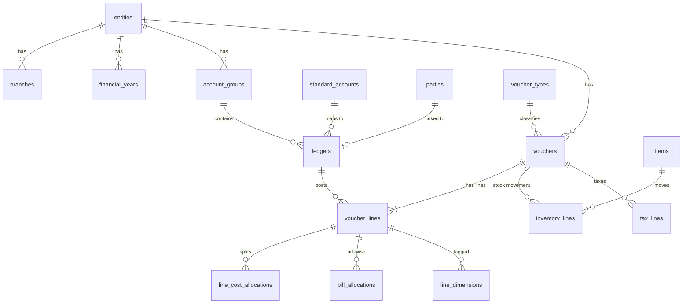

# Database Schema: Client Deployment (MySQL 8)

| Field | Value |
| --- | --- |
| Version | 0.2 (Draft) |
| Date | 2026-10-08 |
| Related | `docs/requirements.md` (DAT-*, IMP-*, VAL-*, ACC-*, AUD-*), `docs/architecture.md` Section 4 |

This document describes the database inside each **client deployment**. The control plane has its own small database (users, clients, licences), described in `docs/architecture.md` Section 3.

---

## 1. Conventions

| Topic | Convention |
| --- | --- |
| Engine / charset | InnoDB, `utf8mb4`, collation `utf8mb4_0900_ai_ci`. |
| Primary keys | `id BIGINT UNSIGNED AUTO_INCREMENT` unless stated. |
| Money | `DECIMAL(20,4)`. Never `FLOAT`/`DOUBLE`. |
| Quantities, rates | `DECIMAL(20,6)`. |
| Sign convention | **Debit = positive, credit = negative** for all amounts in the canonical layer. |
| Dates | `DATE` for accounting dates; `DATETIME(6)` in UTC for system timestamps. |
| Timestamps | Every table has `created_at`, `updated_at`. |
| Deletes | Synced data is soft-deleted (`is_deleted`), never physically removed, to keep history and audit. |
| Naming | `snake_case`, plural table names, foreign keys named `<table_singular>_id`. |
| Entity scoping | Every canonical business table carries `entity_id`, and every query from reports or AI filters by it. |

### 1.1 Source-tracking columns

Every canonical table populated from a source carries these columns (abbreviated as **[SRC]** below):

| Column | Type | Purpose |
| --- | --- | --- |
| `connection_id` | BIGINT UNSIGNED | Which connection the record came from. |
| `source_key` | VARCHAR(191) | Stable ID in the source (Tally GUID, Zoho ID, file row key). |
| `source_alter_id` | BIGINT NULL | Source change counter (Tally AlterID) for incremental sync. |
| `origin` | ENUM('live','backup','file','manual') | How the record arrived (IMP-004). |
| `import_batch_id` | BIGINT UNSIGNED NULL | Batch for backup/file imports. |
| `raw_record_id` | BIGINT UNSIGNED NULL | Link to the raw record it was built from (lineage). |
| `is_deleted` | BOOLEAN DEFAULT FALSE | Soft delete when removed in source. |

Unique key on `(connection_id, source_key)` makes every sync an idempotent upsert.

## 2. Database layout

Four MySQL schemas (databases) separate concerns and permissions:

| Schema | Contents | Who can access |
| --- | --- | --- |
| `raw` | Data exactly as received from sources. | Application only. |
| `core` | Canonical accounting model. | Application (read/write); reporting user (read). |
| `rpt` | Views and aggregate tables (semantic layer). | Application; reporting user; **AI user (read-only, this schema only)**. |
| `app` | Connections, sync, validation, security, audit. | Application only. |

### 2.1 Database users

| User | Rights | Used by |
| --- | --- | --- |
| `app_rw` | Read/write on all four schemas. | API and workers. |
| `report_ro` | `SELECT` on `core` and `rpt`. | Reporting endpoints. |
| `ai_ro` | `SELECT` on `rpt` only; statement timeout enforced. | AI text-to-SQL execution (AI-003). |
| `migrator` | DDL rights. | Alembic migrations only. |

## 3. `raw` schema

### `raw.raw_records`

| Column | Type | Notes |
| --- | --- | --- |
| id | BIGINT UNSIGNED PK | |
| connection_id | BIGINT UNSIGNED | |
| sync_run_id | BIGINT UNSIGNED NULL | Set for live syncs. |
| import_batch_id | BIGINT UNSIGNED NULL | Set for backup/file imports. |
| source_entity_key | VARCHAR(191) | Source company identifier. |
| object_type | VARCHAR(64) | e.g. `ledger`, `voucher`, `stock_item`. |
| source_key | VARCHAR(191) | |
| source_alter_id | BIGINT NULL | |
| payload_format | ENUM('xml','json','csv','txt') | |
| payload | LONGTEXT | Original record, unchanged. |
| payload_hash | CHAR(64) | SHA-256, skips unchanged re-deliveries. |
| received_at | DATETIME(6) | |
| process_status | ENUM('pending','processed','failed','skipped') | |
| process_error | TEXT NULL | |

Indexes: `(connection_id, object_type, source_key)`, `(process_status, received_at)`. Partition by month of `received_at` once volumes grow.

## 4. `core` schema (canonical model)

### 4.1 Organization

#### `core.entities`

| Column | Type | Notes |
| --- | --- | --- |
| id | BIGINT UNSIGNED PK | |
| code | VARCHAR(32) UNIQUE | Short code used in reports. |
| name | VARCHAR(255) | |
| legal_name | VARCHAR(255) NULL | |
| country_code | CHAR(2) | Default `IN`. |
| state_code | VARCHAR(8) NULL | |
| gstin | VARCHAR(15) NULL | |
| pan | VARCHAR(10) NULL | |
| base_currency_code | CHAR(3) | Default `INR`. |
| fy_start_month | TINYINT | Default 4 (April) (DAT-006). |
| books_from | DATE NULL | Company inception / books start (IMP-001). |
| is_active | BOOLEAN | |

#### `core.entity_sources`

Links a source company (e.g. a Tally company) to an entity. One entity can have several sources (Tally for books, a bank feed, a CSV upstream system).

| Column | Type | Notes |
| --- | --- | --- |
| id | BIGINT UNSIGNED PK | |
| entity_id | BIGINT UNSIGNED FK | |
| connection_id | BIGINT UNSIGNED FK | |
| source_entity_key | VARCHAR(191) | Tally company GUID or name, Zoho organization ID. |
| source_entity_name | VARCHAR(255) | |
| precedence | SMALLINT | Higher wins on overlap (IMP-005). |
| active_from / active_to | DATE NULL | Period this source is authoritative for. |

Unique: `(connection_id, source_entity_key)`.

#### `core.branches`

`id, entity_id, code, name, state_code, gstin, is_active`. Unique `(entity_id, code)`.

#### `core.financial_years`

`id, entity_id, label, start_date, end_date, is_closed`. Unique `(entity_id, start_date)`.

#### `core.currencies` and `core.exchange_rates`

- `currencies`: `code CHAR(3) PK, name, decimal_places`.
- `exchange_rates`: `id, from_code, to_code, rate_date, rate DECIMAL(20,8), source`. Unique `(from_code, to_code, rate_date)`.

### 4.2 Chart of accounts

#### `core.standard_accounts`

The standard chart of accounts used for consolidation across entities and sources (RPT-006, CON-011). Seeded with a default structure; editable per client.

| Column | Type | Notes |
| --- | --- | --- |
| id | BIGINT UNSIGNED PK | |
| parent_id | BIGINT UNSIGNED NULL | Hierarchy. |
| code | VARCHAR(32) UNIQUE | |
| name | VARCHAR(255) | |
| nature | ENUM('asset','liability','equity','income','expense') | |
| statement | ENUM('balance_sheet','profit_loss') | |
| statement_line | VARCHAR(64) | e.g. `revenue`, `cogs`, `current_assets`. |
| cash_flow_class | ENUM('operating','investing','financing','cash','none') | For cash flow statement. |
| sort_order | INT | |

#### `core.account_groups` [SRC]

Source group hierarchy (Tally groups), kept as-is per entity.

| Column | Type | Notes |
| --- | --- | --- |
| id | BIGINT UNSIGNED PK | |
| entity_id | BIGINT UNSIGNED FK | |
| parent_id | BIGINT UNSIGNED NULL | |
| name | VARCHAR(255) | |
| nature | ENUM('asset','liability','equity','income','expense') NULL | Derived from primary group. |
| is_primary | BOOLEAN | Tally's 28 predefined primary groups. |
| affects_gross_profit | BOOLEAN | Tally flag for P&L layout. |
| standard_account_id | BIGINT UNSIGNED NULL | Default mapping for ledgers under this group. |

#### `core.ledgers` [SRC]

| Column | Type | Notes |
| --- | --- | --- |
| id | BIGINT UNSIGNED PK | |
| entity_id | BIGINT UNSIGNED FK | |
| group_id | BIGINT UNSIGNED FK | |
| name | VARCHAR(255) | |
| alias | VARCHAR(255) NULL | |
| ledger_kind | ENUM('party','bank','cash','tax','stock','income','expense','asset','liability','equity','other') | |
| party_id | BIGINT UNSIGNED NULL | Set for customer/vendor ledgers. |
| standard_account_id | BIGINT UNSIGNED NULL | Overrides group mapping. |
| mapping_status | ENUM('auto','suggested','confirmed','unmapped') | AI-suggested mappings stay `suggested` until confirmed. |
| opening_balance | DECIMAL(20,4) | Signed; as at `opening_balance_date`. |
| opening_balance_date | DATE NULL | |
| currency_code | CHAR(3) | |
| is_bill_wise | BOOLEAN | |
| is_cost_centre_applicable | BOOLEAN | |
| gstin | VARCHAR(15) NULL | |

Indexes: `(entity_id, group_id)`, `(entity_id, name)`.

### 4.3 Parties, items and other masters

#### `core.parties` [SRC]

| Column | Type | Notes |
| --- | --- | --- |
| id | BIGINT UNSIGNED PK | |
| entity_id | BIGINT UNSIGNED FK | |
| name | VARCHAR(255) | **Sensitive** (masking candidate). |
| party_type | ENUM('customer','vendor','both','other') | Tally: Sundry Debtors → customer, Sundry Creditors → vendor. |
| gstin | VARCHAR(15) NULL | |
| pan | VARCHAR(10) NULL | **Sensitive.** |
| state_code | VARCHAR(8) NULL | |
| country_code | CHAR(2) NULL | |
| credit_days | INT NULL | Used for ageing and overdue flags. |
| credit_limit | DECIMAL(20,4) NULL | |
| email, phone | VARCHAR NULL | **Sensitive.** |

#### Other masters [SRC]

| Table | Key columns |
| --- | --- |
| `core.voucher_types` | `entity_id, name, base_type ENUM('sales','purchase','payment','receipt','journal','contra','debit_note','credit_note','stock_journal','delivery_note','receipt_note','other'), is_accounting, is_inventory` |
| `core.item_groups` | `entity_id, parent_id, name` |
| `core.items` | `entity_id, item_group_id, name, code, unit_id, hsn_code, gst_rate, opening_qty, opening_value` |
| `core.units` | `entity_id, symbol, name, decimal_places` |
| `core.godowns` | `entity_id, parent_id, name` |
| `core.cost_centres` | `entity_id, parent_id, category, name` |

### 4.4 Dimensions (DAT-005)

User-defined reporting dimensions beyond the built-in ones (entity, branch, cost centre, party, item, period).

| Table | Columns |
| --- | --- |
| `core.dimensions` | `id, code, name, applies_to ENUM('voucher','line'), is_active` |
| `core.dimension_values` | `id, dimension_id, entity_id NULL, parent_id NULL, code, name` |
| `core.line_dimensions` | `voucher_line_id, dimension_value_id` (PK both) |

### 4.5 Transactions

#### `core.vouchers` [SRC]

| Column | Type | Notes |
| --- | --- | --- |
| id | BIGINT UNSIGNED PK | |
| entity_id | BIGINT UNSIGNED FK | |
| branch_id | BIGINT UNSIGNED NULL | |
| voucher_type_id | BIGINT UNSIGNED FK | |
| voucher_number | VARCHAR(64) | |
| voucher_date | DATE | |
| reference_number | VARCHAR(128) NULL | |
| reference_date | DATE NULL | |
| party_id | BIGINT UNSIGNED NULL | Main party, if any. |
| narration | TEXT NULL | Searchable via RAG later (AI-010). |
| currency_code | CHAR(3) | |
| exchange_rate | DECIMAL(20,8) DEFAULT 1 | |
| is_cancelled | BOOLEAN | |
| is_optional | BOOLEAN | Tally optional/memo vouchers, excluded from books. |
| is_post_dated | BOOLEAN | |

Indexes: `(entity_id, voucher_date)`, `(entity_id, voucher_type_id, voucher_date)`, `(party_id, voucher_date)`.

#### `core.voucher_lines`

The double-entry lines. For every voucher, `SUM(amount) = 0` (VAL-001).

| Column | Type | Notes |
| --- | --- | --- |
| id | BIGINT UNSIGNED PK | |
| voucher_id | BIGINT UNSIGNED FK | |
| entity_id | BIGINT UNSIGNED | Denormalized for fast filtering. |
| voucher_date | DATE | Denormalized for fast period queries. |
| line_no | INT | |
| ledger_id | BIGINT UNSIGNED FK | |
| amount | DECIMAL(20,4) | Base currency, debit +, credit −. |
| amount_fc | DECIMAL(20,4) NULL | Foreign-currency amount. |
| is_party_line | BOOLEAN | |
| is_effective | BOOLEAN | FALSE when the voucher is cancelled, optional or deleted; reports use only effective lines. |

Indexes: `(entity_id, ledger_id, voucher_date)`, `(voucher_id)`.

#### Line detail tables

| Table | Columns | Source in Tally |
| --- | --- | --- |
| `core.line_cost_allocations` | `id, voucher_line_id, cost_centre_id, amount` | Cost category / cost centre allocations |
| `core.bill_allocations` | `id, voucher_line_id, party_id, bill_type ENUM('new_ref','against_ref','advance','on_account'), bill_name, bill_date, due_date, amount` | Bill allocations (receivables/payables ageing) |
| `core.inventory_lines` | `id, voucher_id, entity_id, voucher_date, line_no, item_id, godown_id, quantity (signed: in +, out −), unit_id, rate, amount, discount_pct, batch_name` | Inventory entries |
| `core.tax_lines` | `id, voucher_id, voucher_line_id NULL, tax_type ENUM('cgst','sgst','igst','cess','tds','tcs','vat','other'), rate, taxable_amount, tax_amount, hsn_code` | GST / TDS details |

### 4.6 Bank data (phase 2, CON-005)

`core.bank_statement_lines`: `id, entity_id, ledger_id (bank ledger), txn_date, value_date, description, reference, amount (signed), running_balance, import_batch_id, matched_voucher_line_id NULL, match_status`. Used for bank reconciliation (VAL-004).

## 5. `app` schema

### 5.1 Integration

| Table | Key columns | Notes |
| --- | --- | --- |
| `app.sources` | `id, code ('tally','file','zoho',...), name, connector_version` | Registered connector types. |
| `app.connections` | `id, source_id, name, config JSON, credentials_enc VARBINARY, agent_id NULL, sync_interval_sec, status ENUM('active','paused','error'), created_by` | Credentials encrypted at application level (CON-009). |
| `app.agents` | `id, name, cert_fingerprint, version, last_seen_at, status` | Connector agents (SYN-004). |
| `app.sync_markers` | PK `(connection_id, source_entity_key, object_type)`, `marker_value` | Last AlterID / timestamp per object type. |
| `app.sync_runs` | `id, connection_id, run_type ENUM('incremental','full','import'), status, started_at, finished_at, records_received, records_failed, error_summary` | SYN-005. |
| `app.import_batches` | `id, connection_id, kind ENUM('backup','file'), file_name, file_sha256, period_from, period_to, status, created_by` | IMP-003, IMP-004. |
| `app.file_layouts` | `id, connection_id, name, column_mapping JSON` | Saved CSV/TXT mappings (CON-003). |

### 5.2 Validation

| Table | Key columns |
| --- | --- |
| `app.validation_runs` | `id, sync_run_id NULL, import_batch_id NULL, entity_id, started_at, status, checks_passed, checks_failed` |
| `app.validation_issues` | `id, validation_run_id, check_code ('voucher_unbalanced','tb_unbalanced','closing_mismatch',...), severity, object_type, object_id, expected_value, actual_value, message, resolved_at` |

### 5.3 Security (ACC-*)

| Table | Key columns |
| --- | --- |
| `app.users` | `id CHAR(36) PK` (same ID as the control plane), `email, display_name, status, password_hash NULL` (`password_hash` used only when `AUTH_MODE=local`) |
| `app.roles` | `id, code, name, is_system` |
| `app.permissions` | `id, code` (e.g. `report.pnl.view`, `ai.query`, `connections.manage`) |
| `app.role_permissions` | `role_id, permission_id` |
| `app.user_roles` | `user_id, role_id` |
| `app.user_entity_access` | `user_id, entity_id, branch_id NULL` (NULL branch = all branches) |
| `app.masking_rules` | `id, role_id, target ('party.name','party.pan','ledger.salary',...), mask_type ENUM('hide','partial','hash')` |

### 5.4 Audit and AI log (AUD-*)

| Table | Key columns |
| --- | --- |
| `app.audit_log` | `id, occurred_at, user_id, action, object_type, object_id, entity_id NULL, details JSON, ip_address` — append-only |
| `app.ai_query_log` | `id, user_id, question TEXT, generated_sql TEXT, status, row_count, duration_ms, provider, model, created_at` |

### 5.5 Configuration

| Table | Key columns |
| --- | --- |
| `app.kpi_definitions` | `id, code, name, formula_view, good_threshold, bad_threshold, direction ENUM('higher_better','lower_better')` (RPT-002) |
| `app.settings` | `key PK, value JSON` |

## 6. `rpt` schema (semantic layer)

Aggregate tables are refreshed by workers after each sync; views sit on top. Only this schema is visible to the AI.

| Object | Type | Purpose |
| --- | --- | --- |
| `rpt.agg_ledger_daily` | Table | `entity_id, ledger_id, date, debit, credit, net`, refreshed incrementally. |
| `rpt.v_ledger_balances` | View | Opening + movements → closing per ledger per period. |
| `rpt.v_trial_balance` | View | Trial balance per entity and period. |
| `rpt.v_pnl_monthly` | View | P&L by month, by standard account and source group. |
| `rpt.v_balance_sheet` | View | Balance sheet as at a date. |
| `rpt.v_cash_flow` | View | Cash flow (indirect method) using `cash_flow_class`. |
| `rpt.v_receivables_ageing` | View | Outstanding customer bills by ageing bucket. |
| `rpt.v_payables_ageing` | View | Outstanding vendor bills by ageing bucket. |
| `rpt.v_sales_monthly` | View | Sales by month, party, item, branch. |
| `rpt.v_expenses_monthly` | View | Expenses by month, ledger, cost centre. |
| `rpt.v_consolidated_tb` | View | Trial balance across entities via `standard_accounts` (inter-company eliminations later). |
| `rpt.v_kpis` | View | Values for `app.kpi_definitions` (health indicators). |
| `rpt.semantic_catalog` | Table | Plain-language description of every view and column, used to build AI prompts (embedded in the vector store). |

## 7. Tally to canonical mapping

| Tally object | Canonical table | Notes |
| --- | --- | --- |
| Company | `entities`, `entity_sources` | Company GUID → `source_entity_key`. |
| Group | `account_groups` | Keep hierarchy; primary group gives `nature`. |
| Ledger | `ledgers` (+ `parties` for Sundry Debtors/Creditors) | GUID → `source_key`; opening balance sign flipped (see below). |
| Voucher Type | `voucher_types` | Parent type → `base_type`. |
| Voucher | `vouchers` | GUID → `source_key`; AlterID → `source_alter_id`; cancelled/optional flags. |
| Ledger entries | `voucher_lines` | **Sign:** Tally XML reports debits as negative amounts; canonical amount = −(Tally amount). Verify with sample data. |
| Bill allocations | `bill_allocations` | |
| Cost centre allocations | `line_cost_allocations` | |
| Inventory entries | `inventory_lines` | |
| Stock Item / Stock Group / Unit / Godown | `items` / `item_groups` / `units` / `godowns` | |
| Cost Centre | `cost_centres` | |
| GST details | `tax_lines`, `items.hsn_code`, `ledgers.gstin` | Fields vary by Tally version; handled in the adapter. |

## 8. Processing rules

1. Connectors write source data to `raw.raw_records` only.
2. A transform step converts pending raw records to canonical rows with upserts on `(connection_id, source_key)`.
3. A record deleted in the source is soft-deleted; its voucher lines get `is_effective = FALSE`.
4. Overlapping data from several sources for the same entity and period is resolved using `entity_sources.precedence` and `active_from/active_to` (IMP-005).
5. Validation runs after each transform (Section 5.2).
6. Aggregates in `rpt` are refreshed for affected entities and dates only.

## 9. Open schema questions

- Inter-company elimination rules for consolidation (when consolidated reporting is built).
- Exact GST fields needed for GST reports (phase 2).
- Whether budgets from Tally are in scope (would add `core.budgets`).
- Partitioning thresholds once real data volumes are known.

## Change log

| Date | Version | Change |
| --- | --- | --- |
| 2026-10-08 | 0.1 | Initial draft. |
| 2026-10-08 | 0.2 | `app.users.password_hash` for local auth mode (pilot). |
